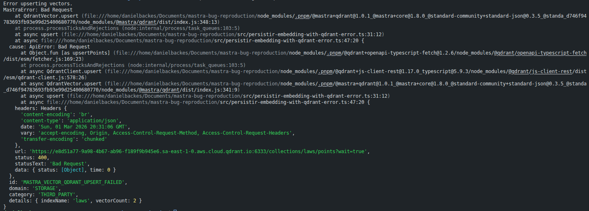

# mastra-bug-reproduction

This project demonstrates an issue in the `@mastra/qdrant` package, specifically in the `upsert` method, when the `ids` 
parameter is provided as a `uint64` value cast to a `string`, as required by the TypeScript definition.

In my project, business logic requires using the relational database ID (an unsigned integer) as the Qdrant point ID.

If I follow the Mastra TypeScript definition and convert numeric IDs to strings, Mastra sends the request to Qdrant with
those string values. Qdrant then throws an error, because it does not accept arbitrary strings for point IDs, only 
`UUID` formatted `strings` and `uint64` values are valid, as described in the 
[Qdrant API - Upsert Endpoint](https://api.qdrant.tech/api-reference/points/upsert-points#request.body.PointsList.points.id).

    

As a workaround, I ignore the TypeScript definition and provide a `uint64` value directly. In that case, everything works 
correctly, except for the TypeScript error shown in my IDE.

## Steps to reproduce

1. Intall Docker and Docker Compose. They are used to run Qdrant intance, so you can skip this step if want use another Qdrant instance.

2. Configure the `.env` file following the `.env.example`.

3. Install dependencies:

    ```shell
    pnpm install
    ```

4. Execute:

    ```shell
    npm run bug-reproduction
    ```

## Expected behavior

The `@mastra/qdrant` package should work when a `uint64` value cast to a `string` is provided.

I verified the `@mastra/qdrant` source code and noticed that several functions convert IDs from strings to integers 
internally. However, the `upsert` method does not perform this conversion when `ids` parameter is provided.

Based on this, I assume it was an architectural decision to keep the store API consistent across different vector 
database integrations by accepting IDs as `string` and converting them internally when required by the underlying database.

Because of that, I would expect the `upsert` method to also handle this conversion.