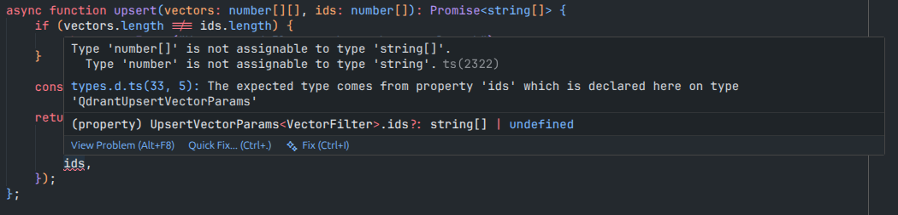

# mastra-bug-reproduction


This project demonstrates an issue in the Qdrant `upsert` method, due to incorrect TypeScript typing of the `ids` parameter.

According to the Qdrant API reference, the `id` field in the upsert endpoint accepts the following types:
  - `uint64`
  - `string` (UUID format only)

Reference [Qdrant API - Upsert Endpoint](https://api.qdrant.tech/api-reference/points/upsert-points#request.body.PointsList.points.id)

In `@mastra/qdrant`, the upsert method defines its parameters using `QdrantUpsertVectorParams`, which extends `UpsertVectorParams` from `@mastra/core`.

Currently, `UpsertVectorParams` defines the `ids` parameter strictly as:
```ts
ids?: string[];
```

#### The Issue

In my project, due to business logic requirements, I need to use the relational database ID as the point ID, which is an unsigned integer.

If I follow the TypeScript definition and convert numeric IDs to strings, Qdrant throws an error because it does not accept arbitrary strings — only UUID-formatted strings are valid.

If I keep my IDs as unsigned integers (which Qdrant supports), TypeScript throws a type error because `ids` is restricted to `string[]`.

This creates a mismatch:

- Qdrant supports: `uint64` | `string` (UUID format)
- Mastra typing supports only: `string[]`

#### Additional Context

While upgrading Mastra to `v1.8`, unaware of this mismatch, I attempted to fix the TypeScript error by converting my IDs to strings.

During final testing, Qdrant began returning errors. After investigating, I discovered that Qdrant does not accept non-UUID strings.

This type mismatch can lead to a confusing debugging process caused by incorrect TypeScript constraints.

## Steps to reproduce

1. Install dependencies:

    ```shell
    pnpm install
    ```

2. Configure Qdrant authentication variables in `.env` following the `.env.example` file.


#### Reproduce Qdrant Error

- Execute:

    ```shell
    node persistir-embedding-with-qdrant-error.ts
    ``` 

- Running the command above does not persist the vector in the Qdrant database and results in the following error:

    


#### Reproduce TypeScript Error

- Execute: 

    ```shell
    node persistir-embedding-with-typescript-error.ts
    ```

- Running the command above successfully persists the vector in the Qdrant database but results in the following TypeScript error:

    